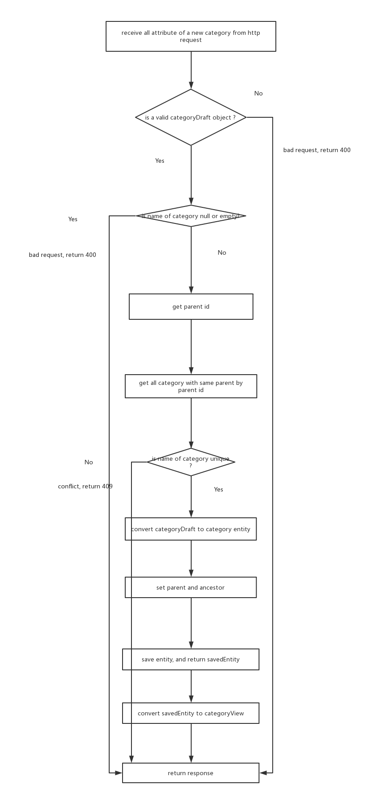

# Category Design for Admin-Web
This document describes how to achieve the admin-web [requirement](./admin-requirement.md).

## 1. Functions
For admin-web, category service provide following functions
+ create a new category
+ delete category
+ update attribute of category
+ get individual category 
+ get all categories in order

## 2. Workflow

### 2.1. Creating a new category

